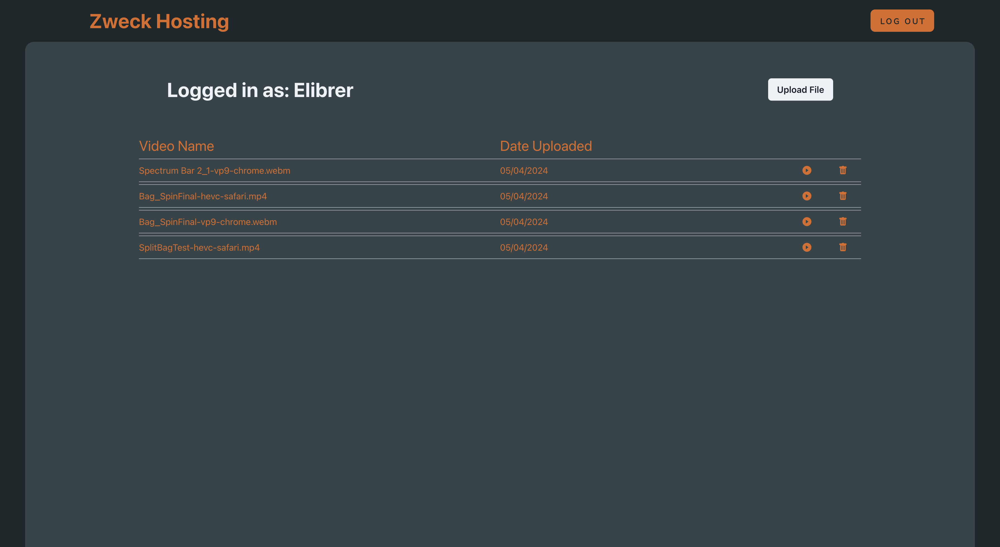
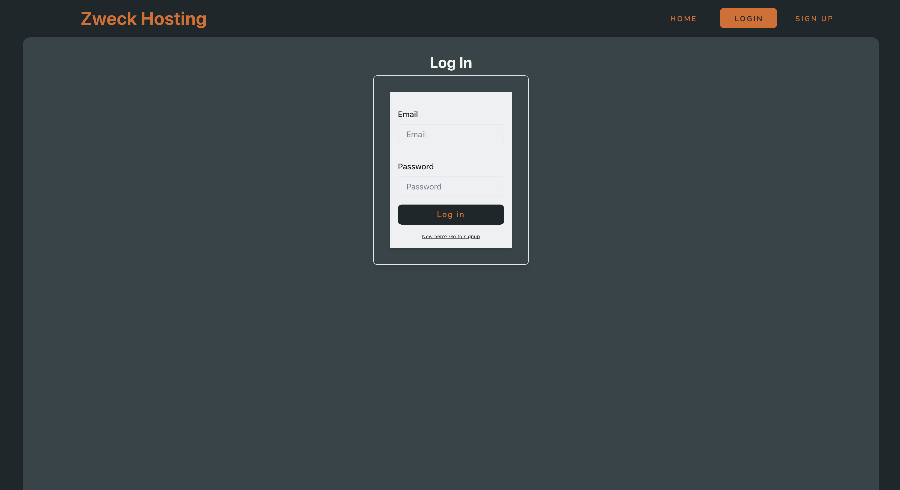

## Zweck Hosting


*A simple web hosting application to store videos and other media*

[](https://developer.mozilla.org/en-US/docs/Web/JavaScript)  [](https://developer.mozilla.org/en-US/docs/Web/CSS) [](https://developer.mozilla.org/en-US/docs/Web/HTML)

---

## Packages used
[](https://react.dev/) [](https://nodejs.org/en/) [](https://mongoosejs.com/) [](https://expressjs.com/) [](https://graphql.org) 
---

## Links
GitHub Repository: [@Zweck Hosting GitHub](https://github.com/Elibrer/zweck-hosting-site)

Link to deployed application: [Zweck Hosting]()

---

## Contributors
> Elijah Brereton [@GitHub](https://github.com/elibrer)

---

## Table of Contents
- [Description](#description)
- [Installation](#installation)
- [Features](#features)
- [Documentation](#documentation)
- [Application Preview](#application-preview)
- [License](#license)
- [Tests](#tests)
- [Questions](#questions)

---

## Description

Zweck Hosting redefines the paradigm of online video hosting by offering cutting-edge solutions that empower creators to showcase their vision with unparalleled clarity. Our platform not only provides seamless video hosting but also preserves the full alpha channel properties, unlocking limitless creative possibilities. Whether you're a filmmaker, animator, or designer, Zweck Hosting offers a comprehensive suite of tools and services tailored to meet your needs. With a commitment to innovation, reliability, and user satisfaction, Zweck Hosting is your ultimate destination for unleashing the full potential of your video content in the digital sphere.

---

## Installation

For usage of this application, visit the [Zweck Hosting]() website. No further installation is required to access and operate the web page. 

---

## Features

- To be added

<!-- ```md
- WHEN the user creates an account
- THEN the application creates a database entry with all their details, and encrypts sensative data, and logs them in
- WHEN the user logs in
- THEN they have access to creating Posts, accepting Commissions, and updating their Profile
- WHEN the user creates a Post on the Post dashboard, including details such as Post Title, Post Description, Post Type, Budget, and Deadline
- THEN the application saves the Post into the database, and displays the Post on the dashboard for all users to see
- WHEN the user accepts another users Post
- THEN the Post is converted into a Commission and is saved into the database
- WHEN the user views their Commissions on the 'My Profile' page
- THEN their Commissions are displayed, and sorted into 'Active' or 'Completed'
- WHEN the user clicks 'Complete Commission' on an 'Active' Commission, then the selected Commission is moved into the 'Completed' section of the page
- WHEN the user changes any settings in the My Profile Settings page
- THEN the database is updated with the new information, including the encryption of newly set passwords
- WHEN the user enters data into the Search Bar and 'Search' is clicked
- THEN the application will display a list of relevant search results, relating to the typed search string
- WHEN the user visits another users profile page
- THEN they are presented with relevant information of that user, and the ability to contact them via email
``` -->

---

## Documentation


---

## Application Preview
### `Zweck Hosting Home`

### `Zweck Hosting Sign Up`

### `Zweck Hosting Log In`



---

## License
[Licensed under the MIT license.](https://opensource.org/licenses/MIT)

---

## Tests
To test, simply run the application by using the instructions provided above. If there are any errors, or the application did not work in the intended way, please try to locate and log the lines of code that bring up the error, and forward all issues to the emails below.

---

## Questions
For questions and enquiries, please contact us at: 

[eli.brer@gmail.com](eli.brer@gmail.com)